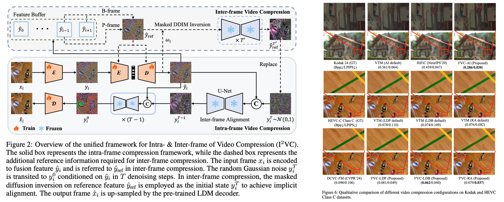

# $\text{I}^2\text{VC}$ : A Unified Framework for Intra & Inter-frame Video Compression


<!-- > [**MaPLe: Multi-modal Prompt Learning**](https://arxiv.org/abs/2210.03117)<br>
> [Muhammad Uzair Khattak](https://scholar.google.com/citations?user=M6fFL4gAAAAJ&hl=en&authuser=1), [Hanoona Rasheed](https://scholar.google.com/citations?user=yhDdEuEAAAAJ&hl=en&authuser=1&oi=sra), [Muhammad Maaz](https://scholar.google.com/citations?user=vTy9Te8AAAAJ&hl=en&authuser=1&oi=sra), [Salman Khan](https://salman-h-khan.github.io/), [Fahad Shahbaz Khan](https://scholar.google.es/citations?user=zvaeYnUAAAAJ&hl=en) -->


<!-- [](https://muzairkhattak.github.io/multimodal-prompt-learning/)
[](https://arxiv.org/abs/2210.03117)
[](https://youtu.be/fmULeaqAzfg)
[](https://drive.google.com/file/d/1GYei-3wjf4OgBVKi9tAzeif606sHBlIA/view?usp=share_link) -->


Official implementation of the paper "[I2VC: A Unified Framework for Intra & Inter-frame Video Compression](https://arxiv.org/)".
<hr />


<hr />

# :rocket: News
- **(May 22, 2024)**
  - Code for our implementation is now available.


<hr />

## Highlights



> **Abstract:** Video compression aims to reconstruct seamless frames by encoding the motion and residual information from existing frames. Previous neural video compression methods necessitate distinct codecs for three types of frames (I-frame, P-frame and B-frame), which hinders a unified approach and generalization across different video contexts. Intra-codec techniques lack the advanced Motion Estimation and Motion Compensation (MEMC) found in inter-codec, leading to fragmented frameworks lacking uniformity. Our proposed \textbf{Intra \& Inter-frame Video Compression (I$^2$VC)} framework employs a single spatio-temporal codec that guides feature compression rates according to content importance. This unified codec transforms the dependence across frames into a conditional coding scheme, thus integrating intra- and inter-frame compression into one cohesive strategy. Given the absence of explicit motion data, achieving competent inter-frame compression with only a conditional codec poses a challenge. To resolve this, our approach includes an implicit inter-frame alignment mechanism. With the pre-trained diffusion denoising process, the utilization of a diffusion-inverted reference feature rather than random noise supports the initial compression state. This process allows for selective denoising of motion-rich regions based on decoded features, facilitating accurate alignment without the need for conventional MEMC. Our experimental findings, across various compression configurations (AI, LD and RA) and frame types, prove that I$^2$VC outperforms the state-of-the-art perceptual learned codecs. Impressively, it exhibits a 58.4\% enhancement in perceptual reconstruction performance when benchmarked against the H.266/VVC standard (VTM).

## Main Contributions

1) **Unified framework for Intra- and Inter-frame video compression:** The three types of frames (I-frame, P-frame and B-frame) across different video compression configurations (AI, LD and RA) within a GoP are uniformly solved by one framework.
2) **Implicit inter-frame feature alignment:** We leverage DDIM inversion to selective denoise motion-rich areas based on decoded features, achieving implicit inter-frame feature alignment without MEMC.
3) **Spatio-temporal variable-rate codec:** We design a spatio-temporal variable-rate codec to unify intra- and inter-frame correlations into a conditional coding scheme with variable-rate allocation. 

## Requirements
To install requirements:
```python
pip install -r requirements.txt
```

## Data preparation
Please follow the instructions at [DATASETS.md](docs/DATASETS.md) to prepare all datasets.

## Model Zoo

Coming soon.

## Training
To train the model in the paper, run this command:
```bash
bash scripts/run.sh
```

## Evaluation
To evaluate trained model on test data, run:
```bash
bash scripts/test.sh
```


<hr />

## Citation
If you use our work, please consider citing:
```bibtex
@inproceedings{2024i2vc,
    title={I2VC: A Unified Framework for Intra & Inter-frame Video Compression},
    author={Meiqin Liq, Chenming Xu, Yukai Gu, Chao Yao, Yao Zhao},
    publisher = {arXiv},
    year={2024}
}
```


## Contact
If you have any questions, please create an issue on this repository or contact at mqliu@bjtu.edu.cn, chenming_xu@bjtu.edu.cn or yukai.gu@bjtu.edu.cn.


## Acknowledgements

Our code is based on [DCVC](https://github.com/microsoft/DCVC) repository. We thank the authors for releasing their code. If you use our model and code, please consider citing these works as well.